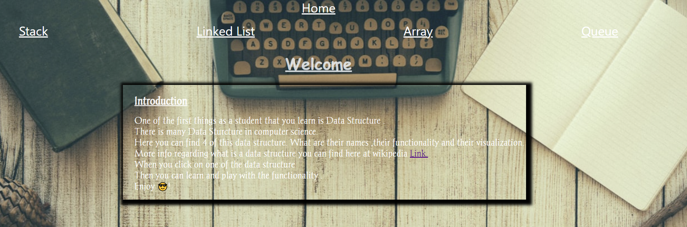

  [](https://shields.io/)
  [](https://shields.io/)
  
  


# Introduction: Data Structure Info
## User Story

```
AS AN Computer Science student
I WANT to study about Abstract Data Structure
SO THAT I can be able to solve intrerview questions.
```

## Screenshot




## Getting Started

* Using gh-pages - Deploy on github.
* Using react-router-dom.

### Prerequisites

Visual Studio Code.

## Built With

- HTML 5 
- CSS
- JavaScript
- React

## Authors

- Philip Kouchner
- Github link - https://philipk-webdev.github.io/DataStructure/